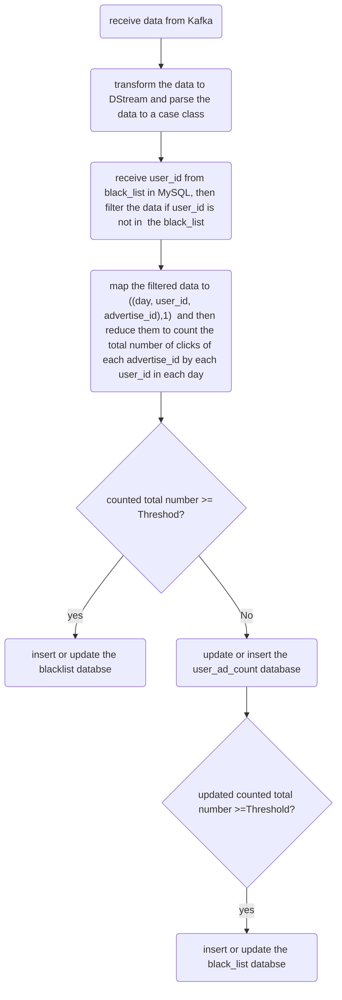

BlackList_filter_create.scala

## 1.functions of this system.
System receives the flow data from the Consumer of the Kafka. It monitors and accumulates the number of times that one user clicks on one product on a website every day. If the number of times is greater than a threshold (for example, 20 times), then the user_ID will be added to the blacklist on MySQL.

## 2.Why using the MySQL DataBase to store the black_list and the transaction of the clicking?
Although the updateStateByKey function can also accumulate the data from Kafka. but it needs to set the checkPoint path to store the buffer data. Too many buffer files in checkPoint will lower the system performance. 
so using the MySQL to store the transactions and black_list is an alternative useful way.

###3. special point:
Specially, The creation and destruction of connection objects will cost the time heavily. If using the foreach function, each RDD will create one connection, this will lower the system performance seriously. 
but in contrast, if using the foreachPartition in DStream ,this will only create one connection object in each partition.
this can greatly reduce the cost to the system and can improve the performance greatly.

##### 
## 3. flowchart of this project




## 4. Code description
### 4.1 file(BlackList_filter_create.scala)
```
/*
    1. receive data from Kafka,
    2. transform the data to DStream and parse the data to a case class
    3. select user_id from black_list, then filter the data if user_id is not in  the black_list
    4. map the filtered data to ((day, user_id, ad_id),1)  and then reduce them to count the total number
     of clicks to each advertise_id by each user_id in each day.
    5. if counted_total_number >20 then insert or update the blacklist.
    6. if counted_total_number <=20, then update or insert into the user_ad_count ,
    if the updated counted_total_number >20, then insert or update the user_id into  black_list

     */

```
 above codes are responsible for monitoring and accumulating the number of times.

### 4.2 file(SparkStreaming_MockData)
```
/*
1. to Generate simulation Mock data
     formate: timestamp area city user_id ad_id
     meaning: timestamp area city user_id,advertisement_id
2. to produce the data to Producer of Kafka, the topic is "aiShengYing"
*/
```
above code is responsible for creating the simulating mock data to the producer of Kafka.


