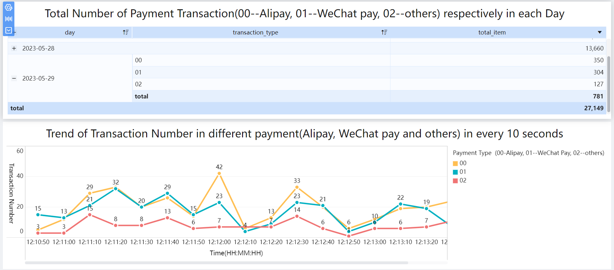

## 1. Overview
This Spark-based analytics platform supports multiple credit card intelligence use cases across real-time monitoring, risk control, and strategic planning. It includes three core modules:  
(1) **Trend_Payment_Type_From_Kafka**, which uses Spark Streaming to consume transaction data from Kafka every 10 seconds, aggregates volumes by payment type (Alipay, WeChat Pay, Others), and visualizes daily trends in FineBI for dynamic payment behavior tracking;  
(2) **Transactions_Real_Time_Risk_Monitoring_and_Processing**, a streaming fraud detection system that monitors per-card transaction frequency at each merchant and automatically adds suspicious cards to a MySQL blacklist when thresholds are exceeded;  
(3) **Regional_Card_Performance_Analysis**, which leverages Spark SQL and a custom UDAF to rank the top 3 credit card types by transaction count in each Chinese region and reveal their acquiring channel concentration—for example, “60% of transactions acquired through Shanghai Branch.”  

Together, these modules provide **real-time payment visibility**, **automated risk control**, and **data-driven regional insights**.

## 2. Result of these functions(partial):
(1) Trend_Payment_type_From_Kafka


(2) card_type_Best_market_share_ratio_in_Branches 
```
+---------------+------------------------------------------+---------------+----------------------------------------------------+----+
|area           |Card_Type_NAME                            |Transaction_CNT|Market_Share_Proportion                             |RANK|
+---------------+------------------------------------------+---------------+----------------------------------------------------+----+
|East China     |Standardized VISA cards                   |371            |ShangHai Branch :16% ,HangZhou Branch :15% ,3rd: 69%|1   |
|East China     |Centurion VISA cards                      |366            |ShangHai Branch :17% ,WuXi Branch :15% ,3rd: 68%    |2   |
|East China     |High-class MASTER cards                   |366            |HangZhou Branch :15% ,QingDao Branch :15% ,3rd: 70% |2   |
|NorthEast China|Chi-bi Maruko co-branded MASTER cards     |169            |HarBin Branch :35% ,DaNian Branch :34% ,3rd: 31%    |1   |
|NorthEast China|GQ co-branded VISA cards                  |165            |HarBin Branch :35% ,DaNian Branch :32% ,3rd: 33%    |2   |
|NorthEast China|AngryBirds co-branded MASTER cards        |159            |HarBin Branch :38% ,DaNian Branch :37% ,3rd: 25%    |3   |
|NorthEast China|NARUTO co-branded VISA cards              |159            |ShenYang Branch :37% ,DaNian Branch :32% ,3rd: 31%  |3   |
|North China    |Corporate MASTER cards                    |264            |BaoDing Branch :25% ,ZhengZhou Branch :25% ,3rd: 50%|1   |
|North China    |Tencent co-branded VISA cards             |264            |BeiJing Branch :24% ,ZhengZhou Branch :23% ,3rd: 53%|1   |
|North China    |IQiyi co-branded VISA cards               |260            |ZhengZhou Branch :23% ,BaoDing Branch :20% ,3rd: 57%|3   |
|SouthWest China|Lucky Carp MASTER cards                   |176            |ChengDu Branch :35% ,GuiYang Branch :35% ,3rd: 30%  |1   |
|SouthWest China|Standard car owner VISA cards             |169            |GuiYang Branch :37% ,ChengDu Branch :34% ,3rd: 29%  |2   |
|SouthWest China|Starlight VISA cards                      |163            |Chongqing Branch :39% ,ChengDu Branch :30% ,3rd: 31%|3   |
|South China    |Social network featured MASTER cards      |224            |XiaMen Branch :29% ,FuZhou Branch :24% ,3rd: 47%    |1   |
|South China    |Game-featured MASTER cards                |222            |ShenZhen Branch :27% ,XiaMen Branch :26% ,3rd: 47%  |2   |
|South China    |Disney co-branded VISA cards              |212            |FuZhou Branch :27% ,ShenZhen Branch :25% ,3rd: 48%  |3   |
|NorthWest China|Specialized MASTER cards                  |116            |Xi'An Branch :54% ,YinChuan Branch :45%             |1   |
|NorthWest China|Fashion-featured VISA cards               |114            |YinChuan Branch :53% ,Xi'An Branch :46%             |2   |
|NorthWest China|Cartoon-featured MASTER cards             |113            |Xi'An Branch :54% ,YinChuan Branch :45%             |3   |
|Central China  |THE LOST CANVAS co-branded VISA cards     |117            |Wuhan Branch :51% ,CHangSha Branch :48%             |1   |
+---------------+------------------------------------------+---------------+----------------------------------------------------+----+

```


