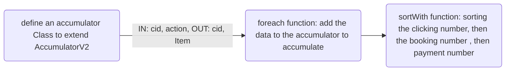

## 1.functions of this sparkProject.
includes these analysis functions:
1. "Best10Clicking_Booking_Paying"---It selects the first 10 best categories of product in a website that have been clicked, booked and pay. It sorts firstly the total number of clicking, then total number of booking, then total paying number. especially, comparing the traditional method to count the total number, it uses an Accumulator to accumulate the total number. this way can avoid the shuffle operation so that can improve the performance greatly. 
2. "BlackList_filter_create"---It receives the flow data from the Consumer of the Kafka. It monitors and accumulates the number of times that one user clicks on one product on a website every day. If the number of times is greater than a threshold (for example, 20 times), then the user_ID will be added to the blacklist on MySQL.
3. "First2cities_in_3_category_in_eachArea"---It can list the most 3 popular products and related total clicking number in different areas in China.
   in each area, the system can also respectively list 2 biggest rates and names of the cities in these clicking transactions.
4. "First5goodUsers_in_best10Categories_Analysis"---It firstly selects the first 10 categories of product in a website that have been clicked, booked and pay. and secondly it lists the top 5 session_id and total clicking number of each session in each 10 category.
5. "FiveMinuteFromKafkaTrend"--- It receives the data from Kafka to DStream then counts the total number of clicking within 5 minutes in each 10 seconds.
6. "PageFlows_convertion_Rate"---It counts the conversion rate of each page to the adjacent page and lists the top 50 with the highest conversion rate.


##### 
## 3. flowchart of this project


```mermaid
flowchart LR
    A(define an accumulator Class to extend AccumulatorV2)-->|IN: cid, action, OUT: cid, Item |B(foreach function: add the data to the accumulator to accumulate) --> C(sortWith function: sorting the clicking number, then the booking number , then payment number)
    
```

## 4. Project resource structure


```
E:.                                          
├─.idea                                      
│  └─codeStyles                              
├─datas                                      
├─output
├─spark-receiver
│  └─receivedBlockMetadata
├─src
│  ├─main
│  │  ├─java
│  │  │  └─cn
│  │  │      └─aishengying
│  │  │          ├─createorder
│  │  │          └─util
│  │  ├─resources
│  │  └─scala
│  │      └─sparkProject
│  │          ├─Best10Clicking_Booking_Paying
│  │          ├─BlackList_filter_create
│  │          ├─First2cities_in_3_category_in_eachArea
│  │          ├─First5goodUsers_in_best10Categories_Analysis
│  │          ├─FiveMinuteFromKafkaTrend
│  │          └─PageFlows_covertingRate
│  └─test
│      └─java
└─target
    └─classes
       └─sparkProject
          ├─Best10Clicking_Booking_Paying
          ├─BlackList_filter_create
          ├─First2cities_in_3_category_in_eachArea
          ├─First5goodUsers_in_best10Categories_Analysis
          ├─FiveMinuteFromKafkaTrend
          └─PageFlows_covertingRate
       

```


