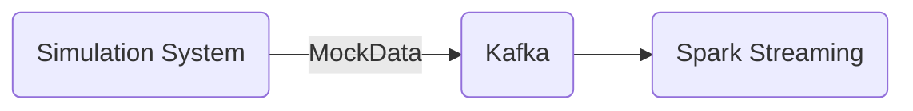
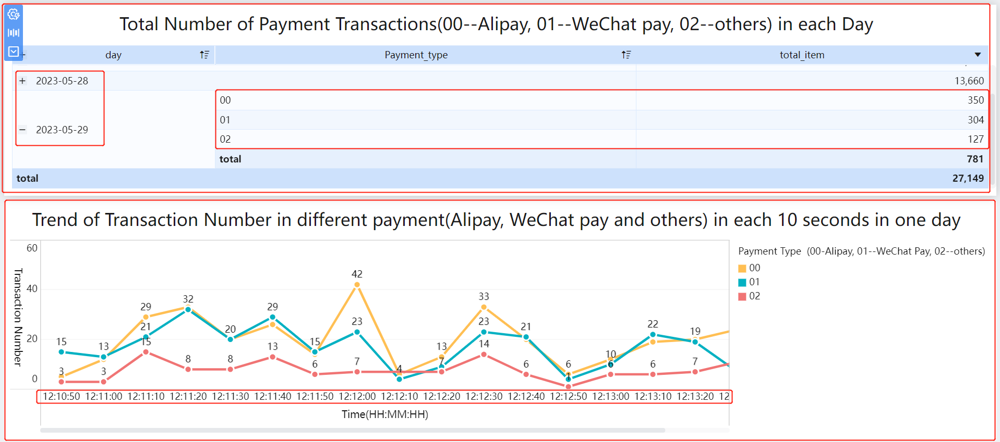

FiveMinuteFromKafkaTrend.scala

# Using the SparkStreaming dynamically analyze the flowing data from Kafka within 5 minutes in each 10 seconds.


## 1.functions of this system.
the system includes these functions:
1. parse the data from Kafka to DStream.
2. because only showing the data in the 0,10,20,30,40,50 second in one minute, so Classify the time of the data into the nearest part(Divide one minute into six parts).
3. count the total number of clicking within 5 minutes in each 10 seconds.(这里没有说清楚滑窗的概念！)

## 2.Why Spark and Kafka? 
### the advantages of Spark：
1. Spark supports streaming computing framework, high throughput and fault-tolerant processing.
2. Spark supports cluster manager, which can efficiently scale computing from one to thousands of nodes.
3. Comparing Hadoop, which saves processing data on disk, Spark saves data in memory when processing data. Thus, the computational efficiency has beengreatly improved.

### the advantages of Kafka：
Kafka is a distributed subscribe message system with high throughput . Based on zookeeper, it has important functions in real-time computing system.
##### 
## 3. flowchart of this project


## 4. System construction:
### Spark high available cluster:
Hadoop: version 2.7.4. It is responsible for the data storage and management.

Spark: version 2.3.2. It is responsible for computing framework.

zookeeper：version 3.4.10

Linux: version CentOS_6.7

JDK: version 1.8

### kafka 
version: 2.11-2.000. 


## 5. Code description
### 5.1 generating the simulation mock data and sending the data to Kafka
(SparkStreaming_MockData.scala)
```
/*
1. to Generate simulation Mock data
     formate: timestamp payment_type card_number merchant_id 
     they are seperated by space
2. to produce the data to Producer of Kafka, the topic is "aiShengYing"
*/
```
in the random method above, system uses the Random to create the clicking data.
It includes the timeStamp, the area name , the city name, the user_id and advertisement_id.


### 5.2 SparkStreaming receives data in Kafka consumer and dynamically analyzes the data in real time
(FiveMinuteFromKafkaTrend.scala)

```
  /*
    1. receive the data from the Producer and parse the data to a Case Class AdClickData.
    2. Classify the time into the nearest part(Divide one minute into six parts).
    3. map this newTime to (newTime,1)
    4. reduceByKeyAndWindow and get the count of (newTime,1) in 5 minutes wide window.
     */
```

### 5.3 the simulation Mock data is like these:

```
sending to Producer :1685350763403 01 5359180080992518 102440183981065 
sending to Producer :1685350763403 00 5359180080996271 102440183982502 
sending to Producer :1685350763403 01 5359180080997903 102440183989820 
sending to Producer :1685350763404 00 5359180080991865 102440183980061 
sending to Producer :1685350763404 02 5359180080992011 102440183986092 
sending to Producer :1685350763404 01 5359180080990696 102440183985130 
sending to Producer :1685350763404 01 5359180080992951 102440183985928 
sending to Producer :1685350763404 01 5359180080999970 102440183985204 
sending to Producer :1685350763404 01 5359180080996377 102440183981552 
sending to Producer :1685350763404 02 5359180080995514 102440183988093 
sending to Producer :1685350763404 01 5359180080991505 102440183987991 
sending to Producer :1685350763404 01 5359180080992192 102440183989179 
sending to Producer :1685350763405 01 5359180080994820 102440183983301 
sending to Producer :1685350763405 01 5359180080991329 102440183989787 

```
### 5.4 the result 



