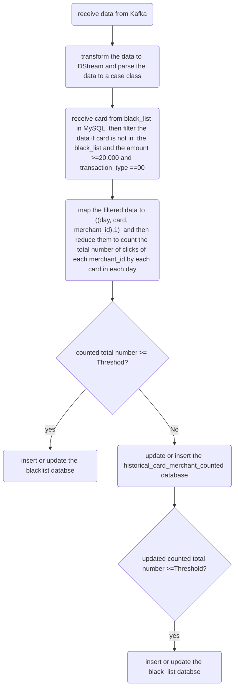

Transactions_Real_Time_Risk_Monitoring_and_processing.scala
## 1.functions of this system.
This is a transaction risk control system. System can receive the flow data from the Consumer of Kafka. It then monitors and accumulates the number of times that one credit card was used in one merchant in each day. If the number of times is greater than a threshold (for example, 20 times), then the card will be added to the blacklist on MySQL.

## 2.Why using the MySQL DataBase to store the black_list and the transaction of the clicking?
Although the updateStateByKey function can also accumulate the data from Kafka. but it needs to set the checkPoint path to store the buffer data. Too many buffer files in checkPoint will lower the system performance. 
so using the MySQL to store the transactions and black_list is an alternative useful way.

###3. special point:
Specially, because the creation and destruction of connection objects will cost the time heavily. If using the foreach function, each RDD will create one connection, this will lower the system performance seriously. 
but in contrast, if using the foreachPartition in DStream ,this will only create one connection object in each partition.
this can greatly reduce the cost to the system and can improve the performance greatly.

##### 
## 3. Flowchart of this project



## 4. Code description
### 4.1 file(BlackList_filter_create.scala)
```
  /*
    1. receive data from Kafka,
    2. transform the data to DStream and parse the data to a case class
    3. select card from black_list, then filter the data if card is not in the black_list and the amount >=20,000 and the transaction_typs is "00"(means: a consumption type transaction)
    4. map the filtered data to ((day, card, merchant_id),1)  and then reduce them to count the total number
     of clicks to each merchant_id by each card in each day.
    5. if counted_total_number >20 then insert or update the card into the blacklist.
    6. if counted_total_number <=20, then update or insert into the historical_card_merchant_counted ,
    if finding the updated total_number in the history_user_ad_count >20, then insert or update the card into  black_list

     */

```
 above codes are responsible for monitoring and accumulating the number of times.

### 4.2 file(SparkStreaming_MockData)
```
/*
1. to Generate simulation Mock data
     formate: timestamp amount transaction_type card merchant_id

2. to produce the data to Producer of Kafka, the topic is "aiShengYing"
*/
```
above code is responsible for creating the simulating mock data to the producer of Kafka.

## 5. Result
### 5.1 the data in table of "historical_card_merchant_counted"
```
day			card				merchant_id		counted_total_number
2023-05-23	5359180080081201	102440189981051	16
2023-05-23	5359180080081201	102440189981052	20
2023-05-23	5359180080081201	102440189981053	16
2023-05-23	5359180080081201	102440189981054	18
2023-05-23	5359180080081201	102440189981055	15
2023-05-23	5359180080081201	102440189981056	19
2023-05-23	5359180080081202	102440189981051	16
2023-05-23	5359180080081202	102440189981052	19
2023-05-23	5359180080081202	102440189981053	18
2023-05-23	5359180080081202	102440189981054	20
2023-05-23	5359180080081202	102440189981055	17
2023-05-23	5359180080081202	102440189981056	17
2023-05-23	5359180080081203	102440189981051	11
2023-05-23	5359180080081203	102440189981052	11
2023-05-23	5359180080081203	102440189981053	22
2023-05-23	5359180080081203	102440189981054	10
2023-05-23	5359180080081203	102440189981055	9
2023-05-23	5359180080081203	102440189981056	17
2023-05-23	5359180080081204	102440189981051	5
2023-05-23	5359180080081204	102440189981052	14
2023-05-23	5359180080081204	102440189981053	12
2023-05-23	5359180080081204	102440189981054	13
2023-05-23	5359180080081204	102440189981055	21
2023-05-23	5359180080081204	102440189981056	8
2023-05-23	5359180080081205	102440189981051	20
2023-05-23	5359180080081205	102440189981052	10
2023-05-23	5359180080081205	102440189981053	11
2023-05-23	5359180080081205	102440189981054	11
2023-05-23	5359180080081205	102440189981055	14
2023-05-23	5359180080081205	102440189981056	13
2023-05-23	5359180080081206	102440189981051	19
2023-05-23	5359180080081206	102440189981052	20
2023-05-23	5359180080081206	102440189981053	15
2023-05-23	5359180080081206	102440189981054	14
2023-05-23	5359180080081206	102440189981055	15
2023-05-23	5359180080081206	102440189981056	20

```
### 5.2 the data in table of "black_list"
```
card
5359180080081201
5359180080081202
5359180080081203
5359180080081204
5359180080081205
5359180080081206

```

