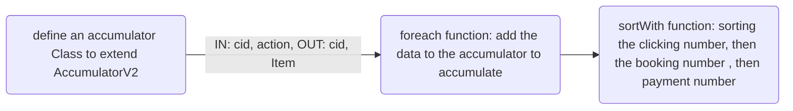

`Best10_Clicking_Booking_Paying_By_Accumulator.scala
`
## 1.functions of this system.
the system includes these functions:
1. It selects the first 10 best categories of product in a website that have been clicked, booked and pay. 
2. The sort policy is firstly to select the biggest total number of clicking. If total number of clicking were equal, then system compares the total number of booking, then total paying number.
3. especially, comparing the traditional method to count the total number, it uses an Accumulator to accumulate the total number. this way can avoid the shuffle operation so that it can improve the system performance greatly.

## 2.Why using the Accumulator?  
### the advantages:
1. comparing other word-count method, using the Accumulator can avoid the shuffle operation in Executor, thus can greatly improve the efficiency.


### how to use this Accumulator?
1. create an accumulator class to extend the AccumulatorV2
2. define the IN type and OUT type.
3. override 6 methods :
   isZero(): to judge whether the Out is zero value or not.
   copy(): to create a new accumulator
   reset(): to set the accumulator to zero value.
   add(): to add the Input of IN to the accumulator within Executor.
   merge(): to merge another same type of accumulator in the Driver.
   value(): to define the final output of this accumulator class.

##### 
## 3. flowchart of this project



## 4. Project resource structure


## 5. Code description
(Best10Clicking_Booking_Paying.scala)
```
/*
 1. define the connection to Spark
  2. define the accumulator extends AccumulatorV2
  3. parse the data
  4. acquire the value from the accumulator
  5. sort the value
  6. print in the console

*/
```

## 6. the result :

```
the best 10 clicking_booking_paying:
category_id:15, (clicking_cnt:6120 booking:1672 paying_cnt:1259 )
category_id:2, (clicking_cnt:6119 booking:1767 paying_cnt:1196 )
category_id:20, (clicking_cnt:6098 booking:1776 paying_cnt:1244 )
category_id:12, (clicking_cnt:6095 booking:1740 paying_cnt:1218 )
category_id:11, (clicking_cnt:6093 booking:1781 paying_cnt:1202 )
category_id:17, (clicking_cnt:6079 booking:1752 paying_cnt:1231 )
category_id:7, (clicking_cnt:6074 booking:1796 paying_cnt:1252 )
category_id:9, (clicking_cnt:6045 booking:1736 paying_cnt:1230 )
category_id:19, (clicking_cnt:6044 booking:1722 paying_cnt:1158 )
category_id:13, (clicking_cnt:6036 booking:1781 paying_cnt:1161 )

```

